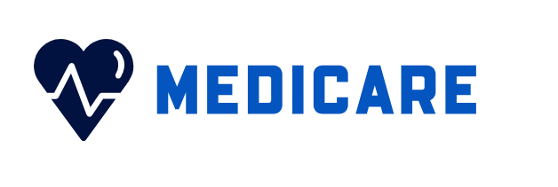
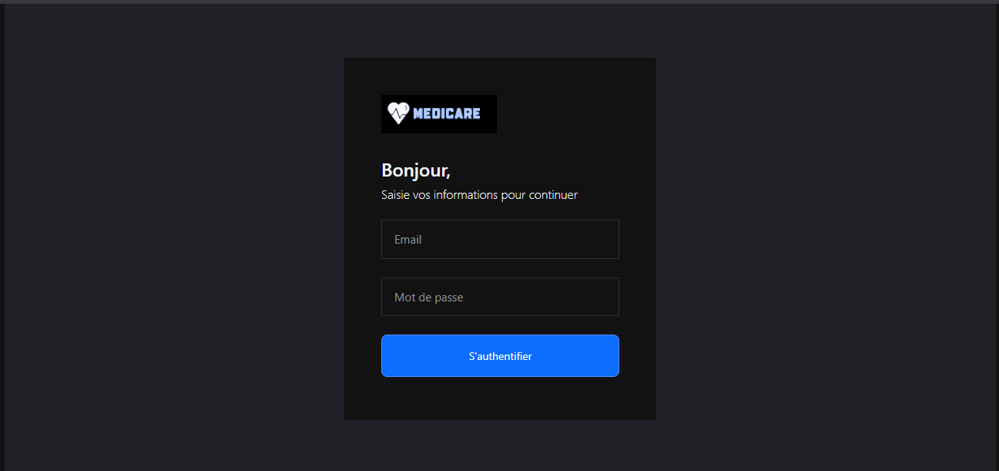
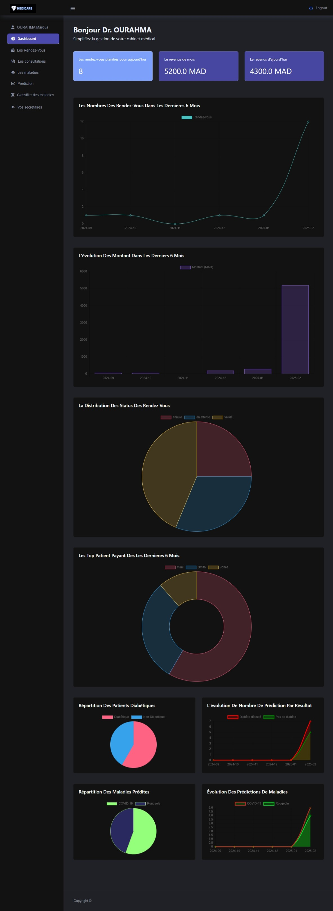
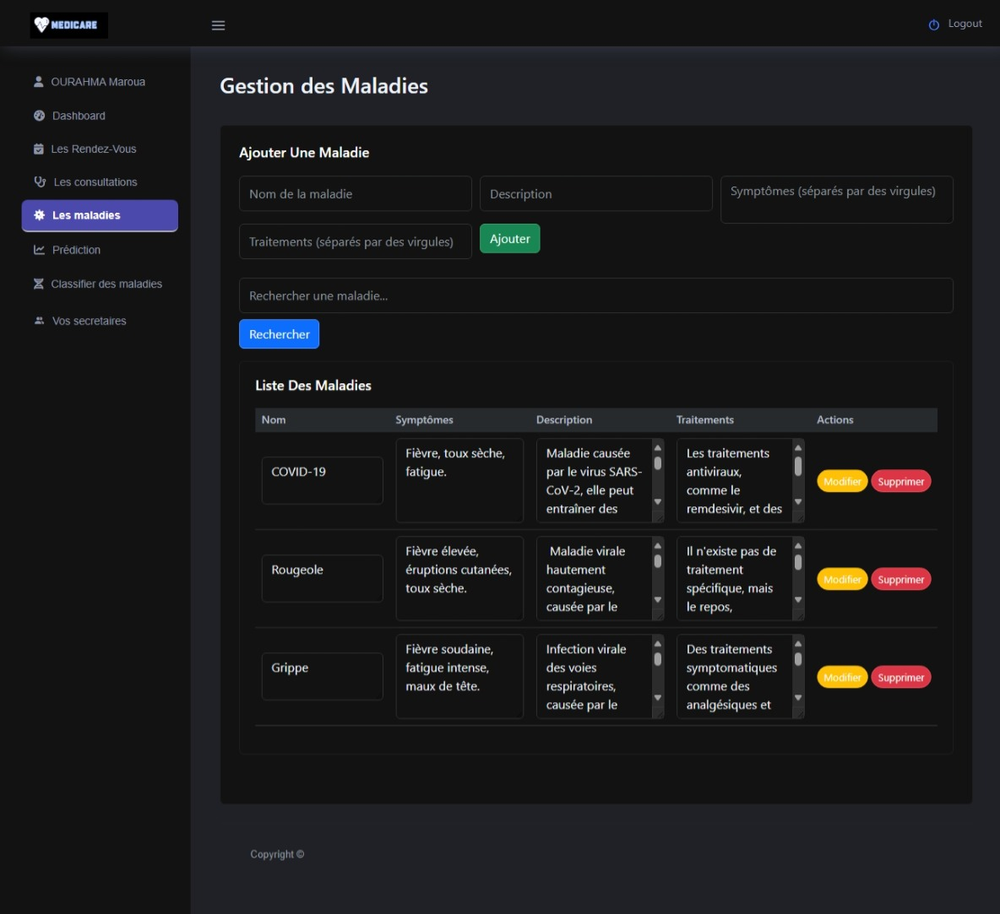
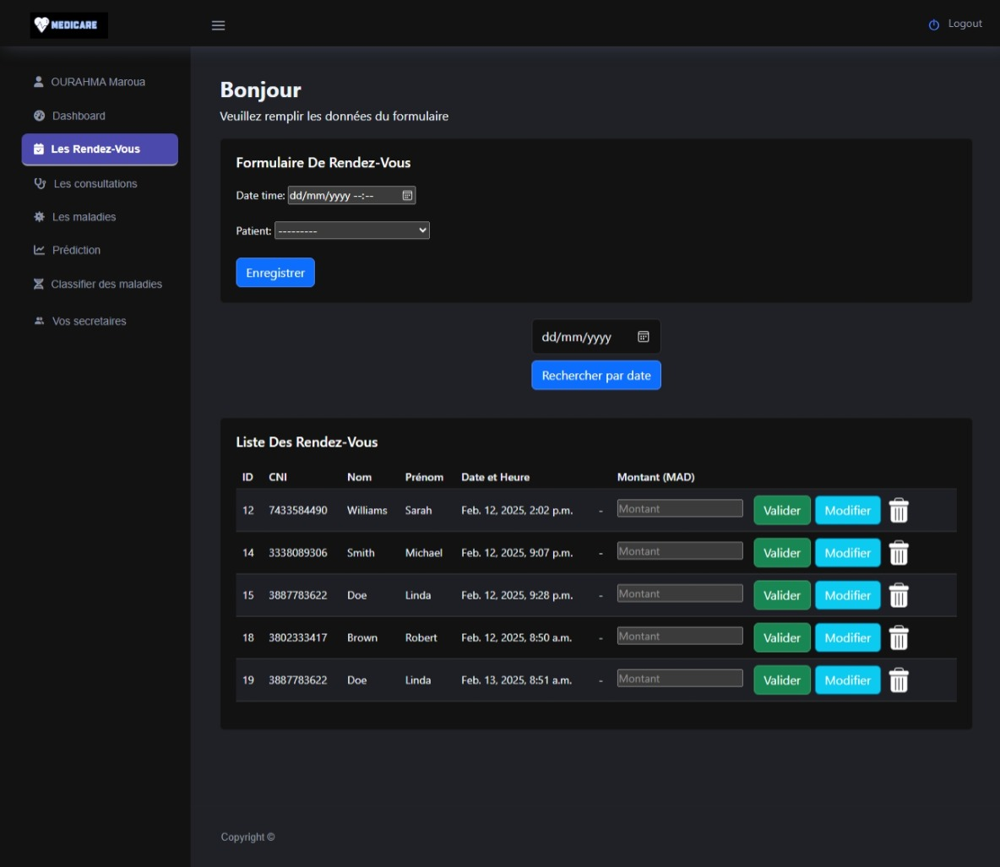
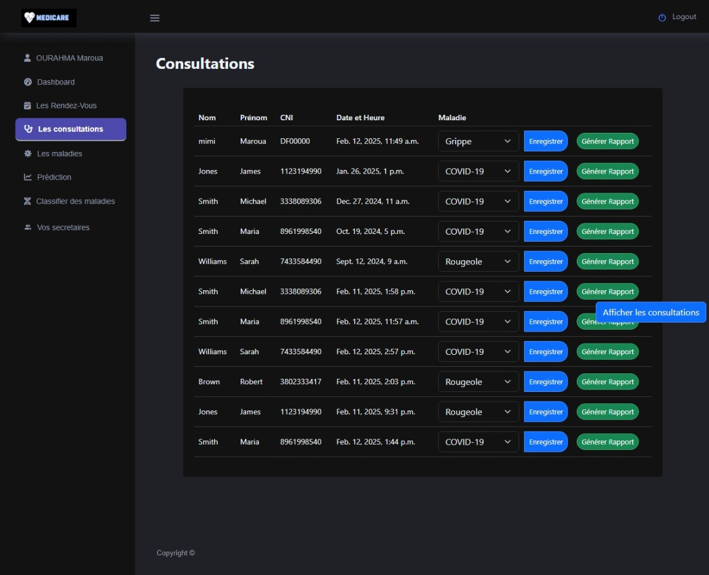
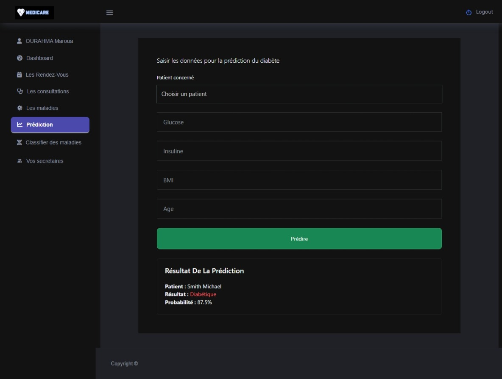
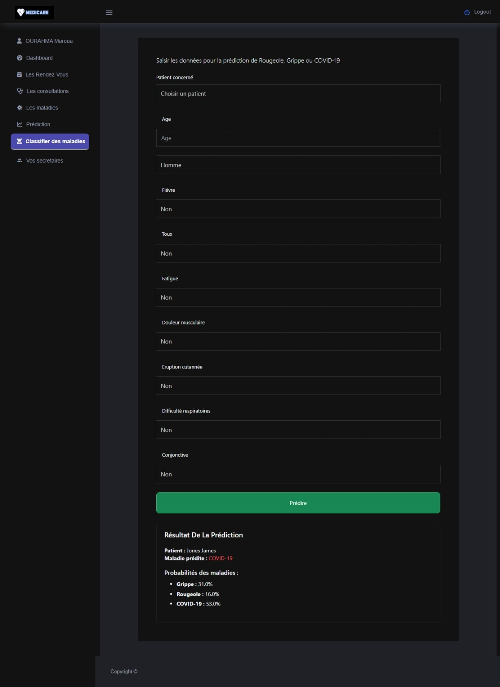

# Projet Health App

  

## Description
Health App est un système de gestion médicale complet destiné aux cabinets médicaux. Il offre une gestion des malades, des rendez-vous, des consultations, des prédictions de maladies, ainsi qu'un suivi des revenus du cabinet. Le projet permet aussi de générer des factures et des rapports médicaux, tout en offrant un tableau de bord pour suivre l'évolution des rendez-vous, les prédictions, et bien plus.

## Fonctionnalités principales
- **CRUD des Maladies** : Permet d'ajouter, modifier, supprimer et afficher les maladies.
- **Gestion des Rendez-vous** : Création et validation des rendez-vous.
- **Consultation Médicale** : Lorsqu'un rendez-vous est validé, il devient une consultation et génère un rapport médical.
- **Prédictions de Maladies** : Prédictions basées sur des critères médicaux pour le diabète et la classification des maladies (COVID-19, Grippe et Rougeole) en utilisant des algorithmes de MAchine Learning tel que **Random Forest Classifier** et **Kneighbor Classifier**.
- **Tableau de bord** : Un dashboard permettant de suivre :
  - L'évolution des rendez-vous.
  - Les revenus du cabinet.
  - L'historique des prédictions.
  - Le nombre de rendez-vous planifié pour ajoued'hui.
  - Les patients ayant payé le plus.

## Prérequis
Avant de commencer, assurez-vous d'avoir installé les éléments suivants :
- Python
- Django
- Joblib
- reportlab

## Utilisation
1. **Se connecter comme Médecin** : Seuls les médecins peuvent ajouter des secrétaires et accéder aux prédictions de maladies.
2. **Ajouter des Secrétaires** : Les secrétaires peuvent être ajoutés par un médecin via le formulaire d'ajout.
3. **Gérer les Maladies** : Vous pouvez ajouter des maladies avec une description, des symptômes et des traitements.
4. **Ajouter des Rendez-vous** : Le médecin peut valider des rendez-vous pour les transformer en consultations.
5. **Génération de Rapports médical** : Après chaque consultation, une facture et un rapport médical sont générés.
6. **Consulter le Tableau de Bord** : Le dashboard affiche les statistiques du cabinet médical (évolution des rendez-vous, revenus, etc.).

## Captures d'écran
Voici quelques captures d'écran de l'application pour mieux visualiser son fonctionnement :

- **Page d'authentification** :

  

- **Tableau de Bord**:

  

- **Gestion des Maladies** :

  

- **La page des rendez-vous** :

  

- **Page de Consultation** :

  

- **Page de prédiction de diabète** :

  

- **Page de classification des maladies (COVID-19, Grippe et Rougeole)** :

  

- **Gestion des secètaires** :

  

  ## Auteur  
- Maroua Ourahma.
    - Email : marouaourahma@gmail.com  
    - LinkedIn : [linkedin.com/in/ourahma](www.linkedin.com/in/maroua-ourahma-293426235)
- Wiame Annejjar.
- Aamer Fadma.

